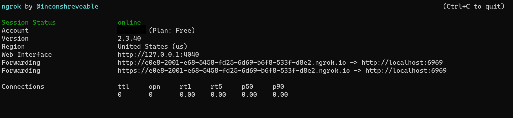
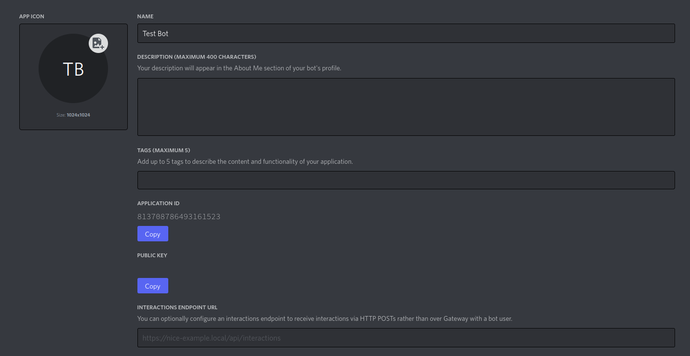

---
uid: Setup.InitialSetup
title: How to setup a bot to use Interacord
---

# How to setup a bot!

Why am I making one of these guides?  
Because setting up a bot to use interaction endpoint is kinda different then what you normally do :D.

## So what do I need to do to setup one?

This guide goes through on how to setup your bot for development. Not for production.  
I will make another guide to setup your bot for production as that requires different tools.

### Choosing what proxy tunnel to use.

For that, you need some tools so discord can access your webserver with HTTPS.  
For this, I would personally recommend to use some tool like ngrok or Cloudflare tunnel (if you have your own domain).  
These will provide you HTTPS connections as discord only allows that for the endpoint.

I would personally recommend to use Cloudflare tunnel over ngrok as it provides a static url meanwhile ngrok gives a new url each time you restart or close down the terminal for the currently running connection.

Here is the links for them

- [ngrok](https://ngrok.com/)
- [Cloudflare Tunnel](https://www.cloudflare.com/products/tunnel/)

I wont go indepht either on how to setup these on your system.

### Configuring settings in your bot

I will be using ngrok for this example.  
If you have setup ngrok correctly this far you should have gotten something like this.

If you have gotten that. Congratulations! You have setup ngrok correctly with the help of google!

Now copy the link ngrok gave you with the https:// and navigate to your bot application.

Now but the url into the interaction endpoint url into the text input shown below

Congratulations! You have succesfully setup your bot to use interaction endpoint!

I will make a tutorial for how to setup interacord later. Good luck bot developing and have fun!
n!